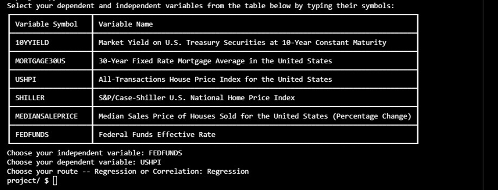
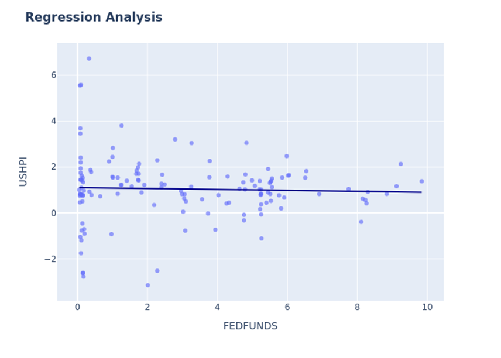

# CorReg Solutions
## Video Demo:  [CorReg Solutions](https://www.youtube.com/watch?v=K-r3pOBjhaU)
### Description:
The program allows users to select independent and dependent variables and then between Regression and Correlation analysis, and then produces the corresponding plots based on their choices.

### Context
The name of my project is CorReg Solutions. CorReg is an acronym derived from a merger of two words, “Correlation” and “Regression.”

The purpose of this program is to help users generate regression and correlation plots in a matter of seconds.

Simple Linear Regression is one of the foundational pillars of research and machine learning. It allows us to explore the relationship between an independent variable and a dependent variable. The goal of regression analysis is to find a linear relationship that highlights the correlation between the two variables, typically with the help of a line that “fits” the observed data. Ultimately, such an analysis helps forecast missing values, a process known as interpolation.

For instance, you want to know how changes in interest rates correlate with residential real estate prices. Or, precisely, you might be interested in understanding what an interest rate hike would mean for the overall housing prices in your state to get a reasonable sense of how the value of your home or residential real estate portfolio (in case you’re an investor) would be affected. To do so, you can carry out a simple linear regression between the dependent variable (housing prices) and the independent variable (interest rate) using data from reliable sources.

Or, you can use CorReg Solutions, which helps regular folks visualize relationships between two variables through regression and correlation analysis in seconds.

As of now, CorReg Solutions comes with a built-in dataset that contains variables relevant to the U.S. real estate sector. In the future, I intend to allow users to add any CSV file they want (with clearly stated column names and values) and output regression and correlation plots. In addition, I also intend to provide users the ability to conduct real-time regression analysis with the help of APIs.

## The Code
Our program comprises four functions: main(), is_valid(), correlation(), and regression().

Let’s see how the program runs.

### Installing Libraries

The program starts by importing the following libraries.

```python
import numpy as np
import pandas as pd
import seaborn as sns
import csv
from tabulate import tabulate
import plotly.express as px
import statsmodels.api as sm
import kaleido
import os
```

Some of these libraries, such as numpy and pandas, are built-in. Others were installed using the pip install feature in Python that allows importing well-maintained libraries from external providers.

Some of these libraries stand out and warrant a brief review. Tabulate allows us to create nicely designed tables through a relatively simple syntax, creating a friendlier experience for end users. Plotly helps us create graphs with a sleek look, again helping users interact with charts more deeply. Kaleido is a library for generating static images, which is how the final outputs (correlation and regression plots) of our program get saved. To allow Pytest to successfully run unit tests for our program's regression and correlation functions, saving the outputs as static images was helpful.

### The Main() Function:

```python
def main():

    df = pd.read_csv('usdata.csv')
    df = df.drop(columns=['DATE'])

    print("Select your dependent and independent variables from the table below by typing their symbols:")

    table = [
    ["10YYIELD", "Market Yield on U.S. Treasury Securities at 10-Year Constant Maturity"],
    ["MORTGAGE30US", "30-Year Fixed Rate Mortgage Average in the United States"],
    ["USHPI", "All-Transactions House Price Index for the United States"],
    ["SHILLER", "S&P/Case-Shiller U.S. National Home Price Index"],
    ["MEDIANSALEPRICE", "Median Sales Price of Houses Sold for the United States (Percentage Change)"],
    ["FEDFUNDS", "Federal Funds Effective Rate"]]

    print(tabulate(table, headers=["Variable Symbol","Variable Name"],tablefmt="heavy_grid"))


    #Prompt the user to select two variables
    indep_var = input("Choose your independent variable: ")
    dep_var = input("Choose your dependent variable: ")

    #Prompt the user to choose between regression or correlation
    validity = is_valid(df, indep_var, dep_var)
    if validity is not None:
        route = input("Choose your route -- Regression or Correlation: ")
        if route == "Regression":
            reg = regression(validity, indep_var, dep_var)

        elif route == "Correlation":
            cor = correlation(validity)

        else:
            print("Choose a valid route")

```
After installing all the libraries, our program begins by initiating the main() function, which makes main() the first entry point of our program. The main() function reads the CSV file titled “usdata.csv” and assigns it to the DataFrame ‘df’.

After that, the program drops the DATE column from the DataFrame because neither was it needed to produce our plots, nor regression or correlation could have "DATE" as a variable (independent or dependent) for obvious reasons.

The main() function then asks the user to select independent and dependent variables ( typed in the same order) while presenting the user with a table to see the symbols and names associated with each variable. The table was created with the help of the Tabulate library. The presence of a table dramatically improves the user experience since the user can easily understand what each symbol refers to and select variables accordingly.



### The Is_Valid() Function:

Once the user selects both variables, the program calls the is_valid() function. The is_valid() function takes in three parameters: the DataFrame (df), the independent variable (indep_var), and the dependent variable (dep_var).

The purpose of the is_valid() function is to check if the variables are valid and return a “subset” of the DataFrame, called data_subset, comprising only the columns representing the independent and dependent variables.

```python
def is_valid(df, indep_var,dep_var):

    if indep_var == dep_var:
        print("Two variables can't be the same.")
        return None

    if indep_var in df.columns and dep_var in df.columns:
        data_subset = df[[indep_var, dep_var]]
        return data_subset

    else:
        print("Invalid variable name")
        return None

```

If the user typed anything else than the name of the variables in the original DataFrame, the is_valid() function returns None with the printed text “Invalid variable name”.

### Prompting User to Choose Between Regression and Correlation:

If the user’s input is valid, i.e., ‘if validity is not None’, the program prompts the user to select either of the two routes: Regression or Correlation. Based on the user’s choice, either the regression or correlation function is called.

If the user types something other than Regression or Correlation, the program outputs “Choose a valid route”.

```python
#Prompt the user to choose between regression or correlation
    validity = is_valid(df, indep_var, dep_var)
    if validity is not None:
        route = input("Choose your route -- Regression or Correlation: ")
        if route == "Regression":
            reg = regression(validity, indep_var, dep_var)

        elif route == "Correlation":
            cor = correlation(validity)

        else:
            print("Choose a valid route")

```
### The Regression() Function

```python
def regression(data_subset, indep_var, dep_var):

    fig = px.scatter(
        data_subset, x=indep_var, y=dep_var, opacity=0.65,
        trendline='ols', trendline_color_override='darkblue'
    )

    fig.update_layout(title_text='<b>Regression Analysis<b>', font_size=12)

    return fig.write_image('regression_plot.png')

```
The regression function takes in three parameters: data_subset, indep_var, and dep_var.

The regression function uses Plotly Express to create a scatter plot with a trend line (aka the best-fit line), outputting the regression plot, which visually depicts the relationship between the independent and dependent variables. The output plot is saved as a png file titled 'regression_plot.png'.

Initially, the program generated figures (both regression and correlation plots) in new tabs using this syntax: return fig.show(). However, when I wanted to run unit tests for the regression (and correlation) functions, Pytest would neither show any figures nor run the tests successfully. To fix this issue, I imported the Kaleido library, which allowed me to save the output as a png file.

### The Correlation() Function:

```python
def correlation(data_subset):
    ds_correlation = data_subset.corr().round(3)
    fig = px.imshow(ds_correlation, text_auto=True, color_continuous_scale='curl')
    fig.update_layout(title_text='<b>Correlation Plot<b>')

    return fig.write_image('correlation_plot.png')

```
The correlation function takes only one parameter: data_subset.

The data_subset.corr().round(3) calculates the correlation coefficients between the two columns in the data_subset DataFrame, rounding each value to three decimal places and assigning the result to ds_correlation. The function then leverages the Plotly Express library to create a heatmap using the px.imshow() syntax that takes the correlation matrix (ds_correlation) as input.

Finally, the correlation function returns an image file – correlation_plot.png - which is exported and saved using the fig.write_image() syntax.

Lastly, the main() function, if implemented directly, is called to execute the program.

```python
if __name__ == "__main__":
    main()
```

## The Final Output:

Let’s say our user selects FEDFUNDS (or Federal Funds Effective Rate), set by the U.S. Federal Reserve and refers to the overnight interest rates that banks in the U.S. can charge each other, as the independent variable, and USHPI (All Transactions Housing Price Index in the United States) as the dependent variable.

Moreover, after selecting the variables, our user goes for the Regression route because she wants to forecast home prices, and the best-fit line can give her a mathematical equation and visual cues to gauge where home prices should be for a given interest rate level based on historical data.

She presses enter, and voila!



#### Note:
The output is saved as a static image for running the Pytest for relevant functions in the code. The non-static output shows the regression equation resulting from the observed data.


